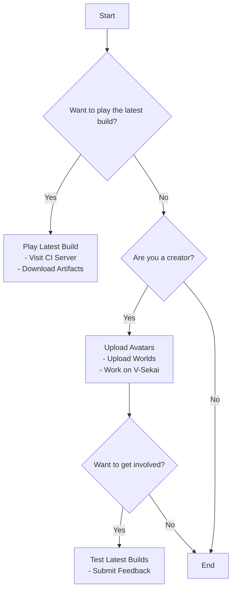

Join us at V-Sekai, an open-source VR community dedicated to creating a user-friendly and free virtual reality platform. Connect with us on our [Discord server](https://discord.gg/7BQDHesck8)! 

`vī-sekai` translates to "V-World" in English.

## Get Involved

1. **Chat**: Connect with us on [Discord](https://discord.gg/7BQDHesck8).
2. **Test**: Try out our latest builds [here](https://v-sekai.github.io/manuals/features/play_latest.html).

